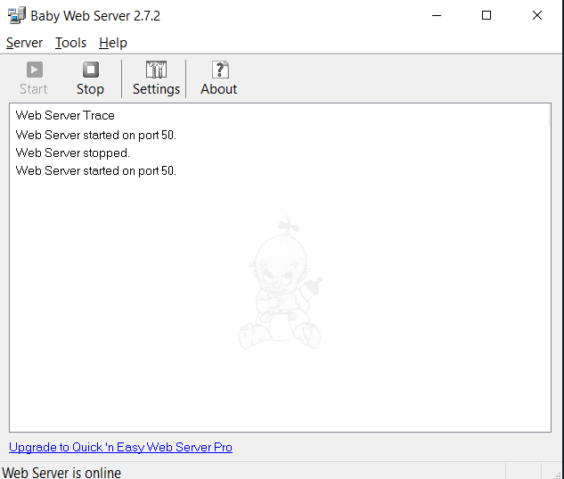
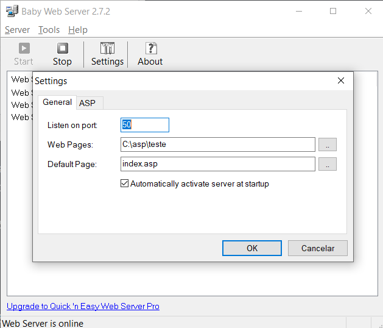
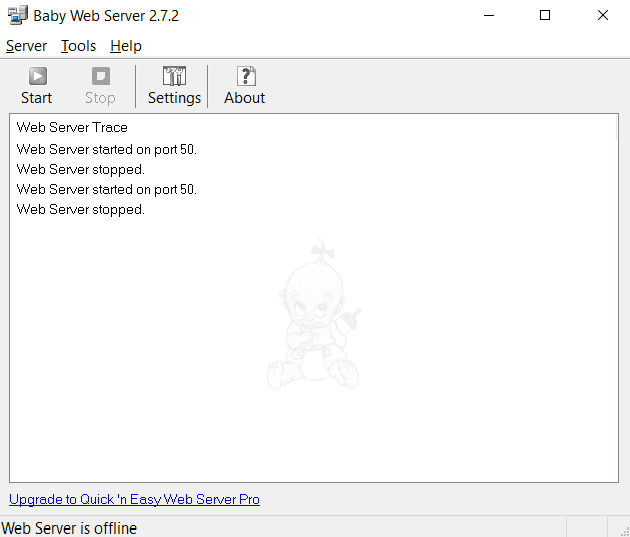
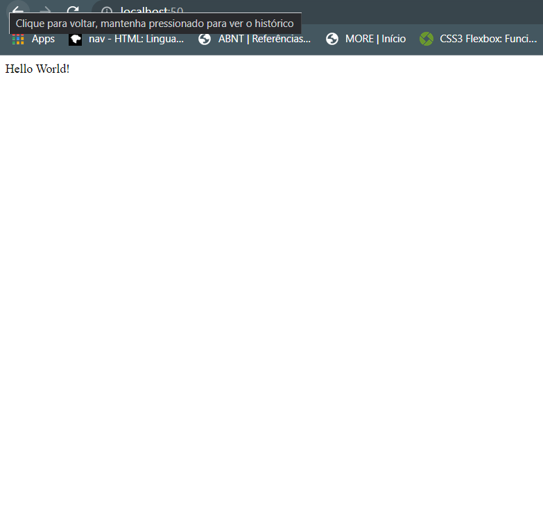
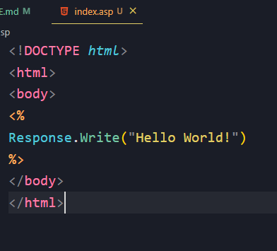

# Configurações do Baby Web Server 2.7.2 x64

## O objetivo principal era projetar um servidor web simples com suporte para ASP.

1. Após descompactar o arquivo na pasta **./instalacao_BabyWebServer**, aparecerá essa interface:

2. Ir em Settings, após isso, configurar a **porta** (qualquer uma), a pasta onde será executada os programas com a extensão (.asp), inserir o arquivo principal dos seus projetos ASP e clique em "Ok".

3. Após ter feito as devidas configurações, pressione "Stop", abra seu navegador e nele digite: localhost:(**Número da porta**)

FIM.